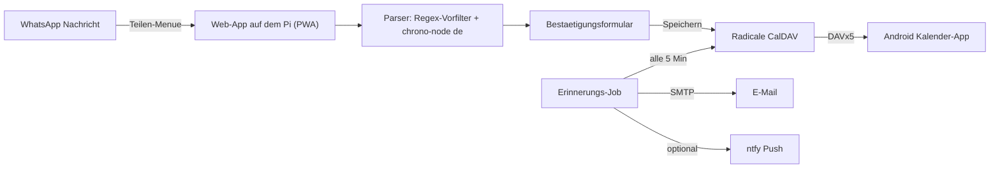

# WhatsApp-Terminassistent für den Raspberry Pi

WhatsApp-Nachricht teilen → Termin wird **deterministisch** (ohne LLM) erkannt → nach kurzer Bestätigung im eigenen Kalender (Radicale/CalDAV) gespeichert → erscheint auf dem Handy → wichtige Termine erinnern zusätzlich per E-Mail und optional per Push (ntfy).



| Dienst     | Aufgabe                                              | Port (nur lokal) | Über Tailscale             |
| ---------- | ---------------------------------------------------- | ---------------- | -------------------------- |
| `app`      | Web-App, Parser, Erinnerungen (Node.js/TypeScript)   | 3000             | `https://<pi>.ts.net`      |
| `radicale` | CalDAV-Kalenderserver                                | 5232             | `https://<pi>.ts.net:8443` |
| `ntfy`     | optional: Push-Benachrichtigungen                    | 8080             | `https://<pi>.ts.net:10000`|

Alle Ports sind nur an `127.0.0.1` gebunden. Erreichbar ist der Pi ausschließlich über Tailscale (HTTPS mit gültigem Zertifikat, keine Portfreigabe am Router nötig).

---

## 1. Raspberry Pi vorbereiten

Voraussetzung: Raspberry Pi 4 oder 5 mit **64-Bit** Raspberry Pi OS (Bookworm oder neuer).

```bash
# Docker installieren
curl -fsSL https://get.docker.com | sh
sudo usermod -aG docker $USER   # danach einmal ab- und wieder anmelden

# Tailscale installieren und anmelden
curl -fsSL https://tailscale.com/install.sh | sh
sudo tailscale up
```

In der [Tailscale-Admin-Konsole](https://login.tailscale.com/admin/dns) **MagicDNS** und **HTTPS Certificates** aktivieren. Der Pi heißt dann z. B. `raspberrypi.tailXXXX.ts.net` (anzeigen mit `tailscale status`).

## 2. Projekt einrichten

```bash
git clone <dieses-repo> ~/kalender && cd ~/kalender   # oder per scp kopieren
cp .env.example .env
nano .env
```

Wichtige Werte in `.env`:

- `PUBLIC_URL`: `https://raspberrypi.tailXXXX.ts.net`
- `APP_TOKEN`: langes Zufallspasswort, z. B. `openssl rand -hex 24`
- `CALDAV_USER` / `CALDAV_PASSWORD`: Zugang zu Radicale (siehe unten)
- `SMTP_*`, `MAIL_TO`: für E-Mail-Erinnerungen (siehe [E-Mail](#5-e-mail-erinnerungen-smtp))

**Radicale-Benutzer anlegen.** Die Datei `radicale/users` muss existieren, *bevor* Docker startet. Sonst legt Docker an ihrer Stelle ein Verzeichnis an.

```bash
# Passwort bcrypt-verschlüsselt speichern (gleiches Passwort wie CALDAV_PASSWORD)
docker run --rm -it httpd:alpine htpasswd -nB ich > radicale/users
```

Starten:

```bash
docker compose up -d --build
docker compose logs -f app      # "Kalender-App läuft" und "Erinnerungsjob gestartet"
```

Beim ersten Zugriff legt die App den Kalender `termine` (Anzeigename `Termine`) in Radicale an.

## 3. HTTPS über Tailscale freigeben

```bash
sudo tailscale serve --bg --https=443  http://127.0.0.1:3000   # Web-App
sudo tailscale serve --bg --https=8443 http://127.0.0.1:5232   # CalDAV für DAVx5
sudo tailscale serve status
```

Die Freigabe bleibt nach einem Neustart erhalten. Rückgängig machen: `sudo tailscale serve reset`.

## 4. Handy (Android) einrichten

1. **Tailscale-App** installieren und mit demselben Konto anmelden.
2. **Web-App anmelden:** In Chrome einmalig `https://raspberrypi.tailXXXX.ts.net/login?token=<APP_TOKEN>` öffnen. Danach bleibt man etwa ein Jahr angemeldet.
3. **Als App installieren:** Chrome-Menü (⋮), dann **„App installieren“** bzw. **„Zum Startbildschirm hinzufügen“**. Erst danach taucht „Kalender“ im Android-Teilen-Menü auf.
4. **Kalender aufs Handy holen:** [DAVx⁵](https://www.davx5.com/) installieren, dann „Konto hinzufügen“ und „Mit URL und Benutzername anmelden“ wählen:
   - URL: `https://raspberrypi.tailXXXX.ts.net:8443/`
   - Benutzer/Passwort: wie in `radicale/users`
   - den Kalender „Termine“ aktivieren. Er erscheint dann in jeder Kalender-App (Google Kalender, Samsung Kalender, Etar …), inklusive Handy-Erinnerung.

### Benutzung

- **Teilen:** In WhatsApp lange auf die Nachricht tippen, dann ⋮ → **Teilen** → **Kalender**.
- **Falls „Teilen“ fehlt** (je nach WhatsApp-Version bei Textnachrichten): **Kopieren**, die Kalender-App öffnen und **„📋 Aus Zwischenablage“** tippen.
- Das Formular ist vorausgefüllt: Titel, Datum, Uhrzeit, ggf. Ende. Weitere erkannte Zeitangaben erscheinen als Buttons.
- **⭐ Wichtig** anhaken: Dann kommt zusätzlich eine E-Mail bzw. Push-Erinnerung, standardmäßig 1 Tag und 1 Stunde vorher.
- Auch direkt am Handy angelegte Termine gelten als wichtig, wenn der Titel mit `!` beginnt (z. B. `! Steuererklärung abgeben`).

Erinnerungen im Überblick:

| Termin                 | Handy (über DAVx⁵)          | E-Mail / Push                             |
| ---------------------- | --------------------------- | ----------------------------------------- |
| normal                 | 30 Min. vorher              | –                                         |
| normal, ganztägig      | Vortag 18:00                | –                                         |
| wichtig                | 30 Min. + 1 Tag vorher      | 1 Tag + 1 Std. vorher                     |
| wichtig, ganztägig     | Vortag 18:00 + 1 Tag vorher | 1 Tag + 1 Std. vor `ALLDAY_REMINDER_TIME` |

## 5. E-Mail-Erinnerungen (SMTP)

Am einfachsten über ein bestehendes Postfach. Beispiele:

| Anbieter | `SMTP_HOST`      | `SMTP_PORT` | `SMTP_SECURE` | Hinweis                                    |
| -------- | ---------------- | ----------- | ------------- | ------------------------------------------ |
| Gmail    | `smtp.gmail.com` | 587         | `false`       | [App-Passwort](https://myaccount.google.com/apppasswords) nötig (2FA an) |
| GMX      | `mail.gmx.net`   | 587         | `false`       | POP3/IMAP/SMTP in den Einstellungen aktivieren |
| WEB.DE   | `smtp.web.de`    | 587         | `false`       | wie GMX                                    |
| Posteo   | `posteo.de`      | 465         | `true`        |                                            |

Ohne `SMTP_HOST` werden fällige Erinnerungen nur geloggt.

## 6. Optional: Push mit ntfy

```bash
# in .env: NTFY_URL=http://ntfy  NTFY_TOPIC=<zufälliger-name>
#          NTFY_PUBLIC_URL=https://raspberrypi.tailXXXX.ts.net:10000
docker compose --profile ntfy up -d
sudo tailscale serve --bg --https=10000 http://127.0.0.1:8080
```

In der ntfy-Android-App einen Server `https://raspberrypi.tailXXXX.ts.net:10000` hinzufügen und das Topic abonnieren.

---

## Wie die Erkennung funktioniert (ohne LLM)

1. **Regex-Vorfilter** (`app/src/parser/prefilter.ts`): Er prüft, ob die Nachricht einen Wochentag, ein Datum, eine Uhrzeit oder „heute/morgen/übermorgen“ enthält.
2. **chrono-node (deutsch)**: Dazu kommen eigene Regeln für Fälle, die chrono nicht kennt:
   - `12.10.` ohne Jahr
   - `halb drei`, `viertel nach vier`
   - `um drei`, `gegen 8`
   - `am Wochenende`
3. **Regeln:**
   - Datum und separat genannte Uhrzeit werden zusammengeführt („Mo. … 10 Uhr“).
   - Bei `um 1` bis `um 6` ohne „früh/morgens“ wird Nachmittag angenommen.
   - Vage Tageszeiten werden zu festen Uhrzeiten: `abends` → 19:00, `nachmittags` → 15:00, …
   - Ohne Uhrzeit wird der Termin ganztägig, ohne Ende dauert er 1 Stunde.
   - „Guten Morgen“ oder „So …“ lösen keinen Termin aus.
4. **Titel**: Er besteht aus dem Nachrichtentext ohne Datumsangaben, Begrüßungen und Füllwörter. Im Formular ist er editierbar.

| Nachricht                                                  | Ergebnis                         |
| ---------------------------------------------------------- | -------------------------------- |
| Hey, wollen wir uns am Freitag um 19 Uhr im Kino treffen?  | Fr 19:00 – „Kino treffen“        |
| Zahnarzt am Montag um 9                                    | Mo 09:00 – „Zahnarzt“            |
| Party am 12. Oktober ab 18 Uhr                             | 12.10. 18:00 – „Party“           |
| Freitag von 14 bis 16 Uhr Workshop                         | Fr 14:00–16:00 – „Workshop“      |
| um halb drei beim Bäcker                                   | nächstes 14:30 – „Bäcker“        |
| Freitag abends so gegen 8 Grillen bei Tom                  | Fr 20:00 – „Grillen bei Tom“     |
| am 3.11. Geburtstag von Lisa                               | 03.11. ganztägig                 |

Die vollständige Liste steht in `app/src/parser/parser.test.ts`.

**Grenzen:**
- „morgen“ bezieht sich auf den Zeitpunkt des Teilens. Bei älteren Nachrichten das Datum im Formular korrigieren.
- Absagen („fällt aus“) und Zeitangaben in der Vergangenheit („Montag war schön“) werden nicht verstanden. Deshalb wird jeder Termin vor dem Speichern bestätigt.

---

## Entwicklung

```bash
cd app
npm install
npm test               # Parser-, Web-, iCalendar- und Erinnerungstests
npm run typecheck
npm run dev            # http://localhost:3000 (CALDAV_* in der Umgebung setzen)
```

Integrationstest gegen einen echten Radicale-Server:

```bash
CALDAV_TEST_URL=http://127.0.0.1:5232/ CALDAV_TEST_USER=ich CALDAV_TEST_PASSWORD=... npx vitest run
```

Icons neu erzeugen: `node scripts/make-icons.mjs`.

Projektaufbau:

```
app/src/parser/    Vorfilter, eigene chrono-Regeln, Titel-Heuristik
app/src/web/       Routen, HTML, Token-Anmeldung
app/src/caldav/    iCalendar erzeugen/lesen, CalDAV-Client (tsdav)
app/src/reminder/  Fälligkeitslogik, SQLite-Speicher, E-Mail/ntfy, Cron-Job
app/public/        PWA: Manifest (share_target), Service Worker, CSS/JS, Icons
radicale/config    Radicale-Konfiguration
```

## Betrieb

- **Update:** `git pull && docker compose up -d --build`
- **Backup:** Die Termine liegen im Volume `radicale-data`:
  ```bash
  docker run --rm -v kalender_radicale-data:/data -v "$PWD":/backup alpine tar czf /backup/radicale-backup.tgz -C /data .
  ```
  Der Volume-Name richtet sich nach dem Ordnernamen; anzeigen mit `docker volume ls`.
- **Logs:** `docker compose logs -f app radicale`

## Fehlersuche

| Problem                                   | Lösung                                                                 |
| ----------------------------------------- | ---------------------------------------------------------------------- |
| „Kalender“ fehlt im Teilen-Menü           | PWA über Chrome installieren (nicht nur Lesezeichen); HTTPS-URL nutzen |
| Startseite: „Kalender nicht erreichbar“   | `CALDAV_USER`/`CALDAV_PASSWORD` stimmen nicht mit `radicale/users` überein; `docker compose logs radicale` |
| Radicale startet nicht, `users` ist Ordner | `docker compose down`, `rm -r radicale/users`, Datei wie oben anlegen  |
| Uhrzeiten um 1–2 Stunden verschoben       | `TZ=Europe/Berlin` in `.env` prüfen                                    |
| Keine E-Mails                             | `docker compose logs app \| grep Erinnerung`; SMTP-Daten/App-Passwort prüfen |
